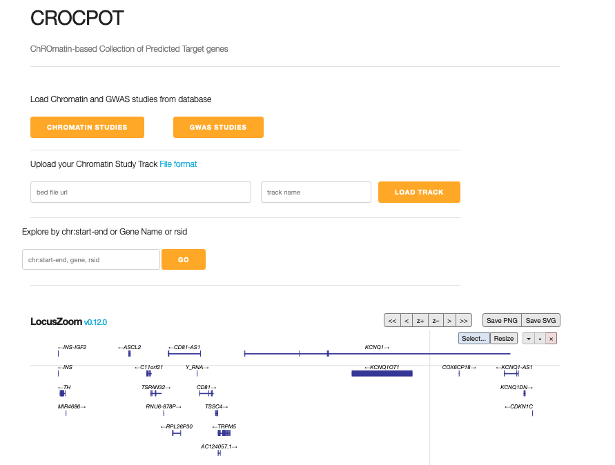

## Quick Start

**1. In a web browser open [CROCPOT](http://www.apps.t2depigenome.org/locuszoom-dev/) genome browser**

**2. Load Chromatin and GWAS Studies**

Chromatin studies such as target gene predictions and coaccessible target genes can be loaded via. Chromatin Studies dropdown button. The dropdown is searchable/filterable by tissue, cell type and assay type. The collection of chromatin studies come from [Diabetes Epigenome Atlas](https://www.diabetesepigenome.org/) and [Lung Genome Browser](https://www.lungepigenome.org/) listed on the [data page](http://www.apps.t2depigenome.org/locuszoom-dev/chromatindata.html). User can upload their own chromatin data tracks (BED file) using Upload Chromatin Study Track input box. Chromatin study track is directly read from an external BED track (tabix indexed). The remote file server must enable CORS support. See document on [tabix conversion & storing files on s3 storage, Azure storage, google cloud and local server](http://www.apps.t2depigenome.org/crocpot-doc/fileserver) for loading files via. URL.

GWAS studies can be loaded via. GWAS dropdown. These studies are searchable/filtered via. study keyword. GWAS studies are loaded for several traits from a selection of about 286 GWAS studies that are loaded via. Locuszoom's REST API. See list of available [GWAS studies](http://www.apps.t2depigenome.org/locuszoom-dev/gwasdata.html). A javascript library(gwas-credible-sets) that uses Bayesian method to perform fine mapping is implemented for GWAS track to calculate credible sets on client-side i.e. calculations are not derived from the backend database but calculated on the fly. 

**3. Navigation**

Genomic region can be navigated via. the search box or shift region +/- 50 Kb or 500 Kb. Use the zoom slider or the z+ and z- buttons on the right top corner of the toolbar to zoom in and out. This will affect all tracks. Search by genomic coordinates, gene, variant. In the text box where the genomic coordinates are displayed, you can type the coordinates of the region you want to view (e.g. 11:2182049&end=2904920) or gene name (FOXA1) or rsid (rs7903146). Upto 1Mbp region can be viwed for the genome browser.

**4. Tracks**

**Chromatin Studies Track**

The chromatin interaction arcs can be filtered by target genes and vice versa thereby easily filtering regulatory elements to putative target genes on genomic scale. Click on and arc to see all the interacting arc and target gene; click on target gene of interest to visualize all the interacting arcs. Loops can be filtered based on co-accessibility score; that allow filtering of cis-regulatory interactions based on co-accessibility. The score filter can be accessed via. top right corner of the toolbar for each track. The tooltip (hover over the arc) displays regulatory element and promoter co-ordinates region, target genes and co-accessibility score. Tracks from multiple cell/tissues and datasets can be rendered with a click to match point with the gene track for comparing co-accessibility across cells/tissues across genomic region.

**GWAS**

Variants in GWAS study are displayed as grey datapoint and credible sets marked as green datapoints. The significance threshold is -log10(5 x 10-8) is marked by dotted line; credible set threshold is set to 95% by default. The tooltip (hovering over the variant dot) gives precise variant location, allele information, posterior proability, p-value and make LD reference on the fly.

**Genes**

Gene Track for GRCh37 is loaded by default

**5. Saving images**

Images for tracks can be saved from SVG or PNG format accessed via. toolbar on the top right corner of the tracks

**6. Methods for Chromatin Studies**

We have listed [Data processing pipelines & resources](http://www.apps.t2depigenome.org/locuszoom-dev/methods.html) for chromatin interaction assays such as HiC, pcHi-C, HiChIP/PLAC-seq, ChIA-PET, 4C, sciATAC/snATAC and capture-C assays 

